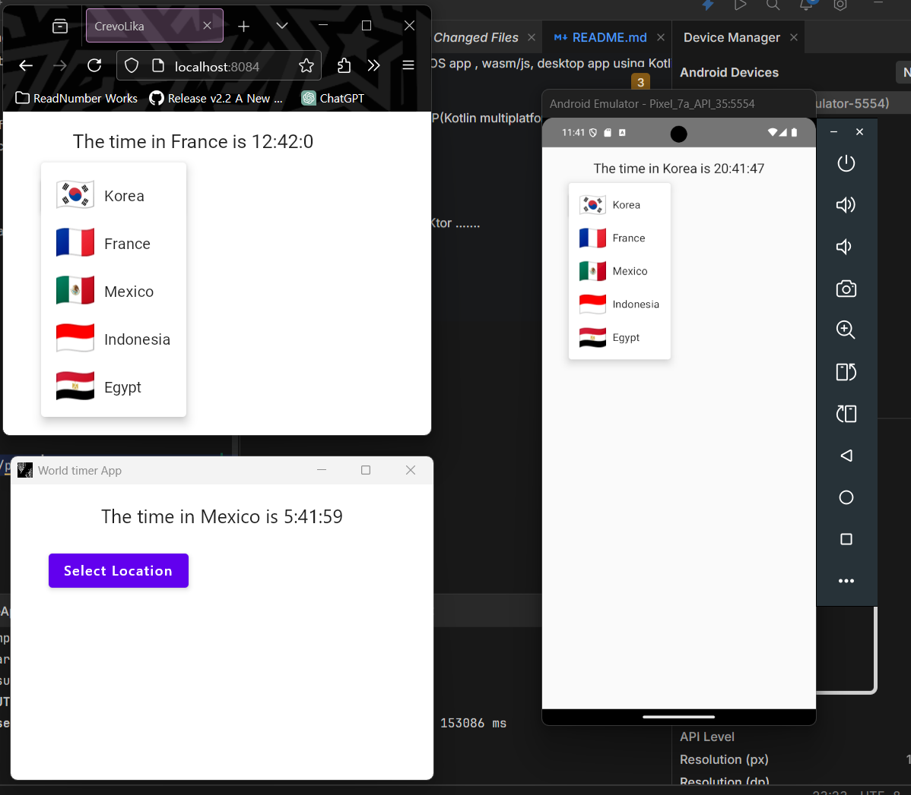

# my-1st-kmp-app-world-timer
my 1st Kotlin multiplatform web/app - World-timer

1st init version created by Huck.Kim huck.kim@kangwon.ac.kr at 2024.12.16

This project is for Android, iOS app , wasm/js, desktop app using Kotlin multiplatform and Compose multiplatform that is capable to share UI and Business logic.

Main purpose is for only KMP(Kotlin multiplatform tech research..)

lib. consists of below

TBD sooner and later 

KMP
CMP
Koin
SQLDelight
Ktor
.......

#Andriod App
# wasm broswer app, Android, Desktop app.

